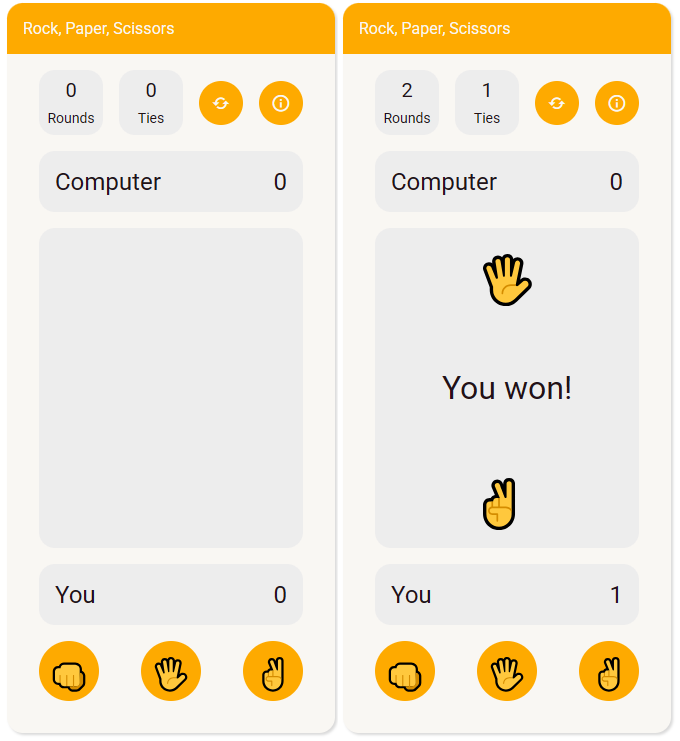

# rock-paper-scissors
Project: Rock Paper Scissors | The Odin Project

This repository contains the code to the Rock Paper Scissors project from the The Odin Project.

Here, the main goal is to apply everything learned in the JavaScript Basics section of the Foundations Course, from Variables and Operators to Understanding Errors.

The project consists of five rounds of the "Rock Paper Scissors" game played through the browser's console tool. The user chooses between "Rock", "Paper" or "Scissors" while the computer randomly chooses one of three options.

The results are logged into the console as soon as the user inputs his or her option. The scores are kept in function-scoped variables, and at the end of the fifth round the winner is declared in the console.

---- UPDATED WITH "REVISITING ROCK PAPER SCISSORS LESSON" ----

Project updated with the "Revisiting Rock Paper Scissors Lesson". Now, it contains an UI where the user can play the game against the computer by choosing one move. Whoever beats the other 5 times first, wins the game.

